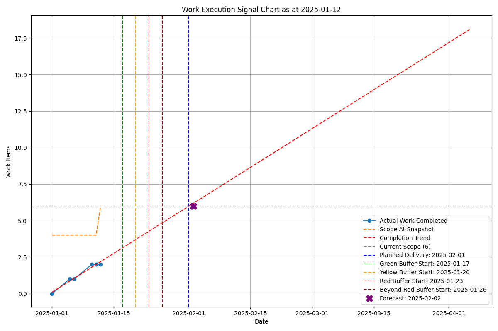
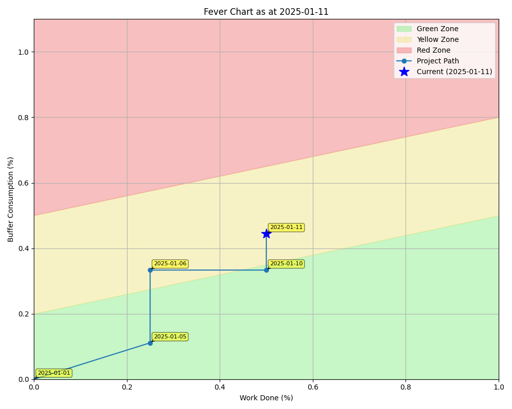

# MOVE Tracker

A Python automation script for generating MOVE (Minimal Outcome-Value Effort) project progress reports. The script reads project data from Excel workbooks, computes progress logs, and generates Work Execution and Fever Charts to track project progress over time.

## Features

- **Automated Progress Tracking**: Generates comprehensive progress logs from project start to any snapshot date
- **Visual Charts**: Creates Work Execution and Fever Charts as PNG images
- **Excel Integration**: Reads from and updates Excel workbooks with calculated data and embedded charts
- **Template Generation**: Creates properly structured Excel templates for new projects
- **Flexible CLI**: Command-line interface with multiple options for different use cases
- **Visual Regression Testing**: Comprehensive test suite for chart visual consistency

## Context

The MOVE Tracker is a desktop tool to help you mananage a collection of work-items using Tameflow approaches.

A collection of work-items that need to be delivered together in order to provide value is called a MOVE in Tameflow jargon.

The tool helps you to create **Work Execution** and **Fever Charts**.

### Tameflow reference

See the book [Standing on Bits - Agile Software Engineering Management at Scale with the Theory of Constraints](https://leanpub.com/standingonbits) page 41.


### Work Execution Chart (Similar to a Burnup Chart)



### Fever Charts (A CCPM-style chart based on the buffer and work done)

CCPM = [Critical Chain Project Management]()

What are Fever Charts?

The idea come stems from the daily temperature checks made on patients in hospital. If the temperature chart is deviates from normal the nurse will call the doctor to consider further action.

{ width=200px }


The fever chart is divided up into action zones. These colour of the current state of the buffers triggers decisions, lile a traffic light 🚦 :

    - Green: Continue execution as planned.
    - Yellow: Investigate root causes, prepare mitigation.
    - Red: Escalate—reallocate resources, mob, re-sequence tasks, or replan.



### What is Tameflow?

Its a broad body of knowledge, to find out more I refer you to [TameFlow.com](https://tameflow.com/) or the [online community](https://circle.tameflow.com/).

- **Steve Tendon's innovation** - Theory of Constraints applied to knowledge work management
- **Four flows framework** - Operational, financial, informational, and psychological flows
- **PEST environments** - Managing multiple Projects, Events, Stakeholders, Teams
- **"The Book of TameFlow"** - Comprehensive guide to TOC in knowledge work
- **Performance vs. productivity** - Focus on multi-dimensional performance outcomes
- **VUCA handling** - Approach for volatility, uncertainty, complexity, ambiguity
- **Historical roots** - Influenced by Borland experience and organizational design patterns
- **Hyper-performance focus** - Beyond traditional Agile framework limitations

## Installation

### Prerequisites

- Python 3.13 or higher (A programming language)
- UV package manager,  recomended (Utility used to install dependencies used by Python to generate charts)
- Spreadsheet program like Excel or LibreOffice

Why Python? Spreadsheets are not able to create the detailed charts we require, Python charting packages are. But as Python is now the standard for data analysis and AI around the world it should be possible to make a case to get it installed on your computer. It's free but if you are in a corporate or enterprise environment you will likely need to make a case to get Python installed on your computer.

### Using UV (Recommended)

See UV [website for installations instructions.]((https://docs.astral.sh/uv/getting-started/installation/))


```powershell
# Make a new working directory
mkdir MOVE-Tracker
cd MOVE-Tracker
```

Open the Github site https://github.com/rnwolf/MOVE-Tracker Have a look at the README.

Download the python script and save it as move_tracker_report.py to the directory you created above.

https://raw.githubusercontent.com/rnwolf/MOVE-Tracker/refs/heads/master/move_tracker_report.py


```powershell
# Check that you have uv working
cd MOVE-Tracker
uv --version
```

## Quick Start

### 1. Display help

```bash
# Display built in help
uv run move_tracker_report.py --help
```


### 2. Create a New Excel Project Template

Why use Excel sheet? Because desktop MS-Ecel provides a powerful, familiar user interface for editing data.

```bash
# Create a new Excel template with sample data
uv run move_tracker_report.py --create-template --excel-path "MyProject.xlsx"
```

### 3. Update Historic Data via Excel

In order to forecast future performance, we assume that it will be similar to past performance. Update the sample data in the spreadsheet.


### 4. Update MOVE work items via Excel

Add the MOVE work items.  The commitment date should be specified which is likey to be the same date as the MOVE start date.
We also cater for the case were items are removed from the scope. Please do not delete the work-item row, rather update the withdrawn date for the work item.

[Add current work items into excel](images)Add current work items into excel](<images/Screenshot 2025-07-11 Current work items.png>)


### 5. Check the MOVE configuration

Make sure that all the paramter values are correct for your MOVE.


### 4.1 Generate Progress Report

```bash
# Generate progress report for a specific date
uv run move_tracker_report.py --excel-path "MyProject.xlsx" --snapshot-date "2025-01-15"
```

### 4.2. Or Generate Charts Only

```bash
# Generate charts without updating Excel file
uv run move_tracker_report.py --excel-path "MyProject.xlsx" --snapshot-date "2025-01-15" --save-charts-only ./charts
```

### 5 Review the generated Progress Log and charts


## Usage Examples

### Command Line Options

```bash
uv run move_tracker_report.py [OPTIONS]
```

**Options:**
- `--excel-path PATH`: Path to the Excel workbook (.xlsx)
- `--create-template`: Create a new Excel template
- `--snapshot-date DATE`: Date for processing (YYYY-MM-DD format)
- `--log-level LEVEL`: Logging verbosity (DEBUG, INFO, WARNING, ERROR, CRITICAL)
- `--no-chart-insertion`: Process data but skip inserting charts into Excel
- `--no-data-update`: Generate charts but skip updating Progress_Log sheet
- `--save-charts-only PATH`: Generate and save charts to specified directory only
- `--overwrite`: Overwrite existing files without prompting

### Examples

**Create a template:**
```bash
uv run move_tracker_report.py --create-template --excel-path "NewProject.xlsx"
```

**Generate full report:**
```bash
uv run move_tracker_report.py --excel-path "Project.xlsx" --snapshot-date "2025-01-15" --log-level INFO
```

**Generate charts only:**
```bash
uv run move_tracker_report.py --excel-path "Project.xlsx" --snapshot-date "2025-01-15" --save-charts-only ./output
```

## Excel File Structure

The script expects an Excel workbook with the following sheets:

### Required Sheets

1. **MOVE_Configuration**: Project parameters and settings
2. **Historic_Work_Items**: Past project data for baseline calculations
3. **Current_Work_Items**: Current project work items
4. **Progress_Log**: Generated time-series progress data (auto-created)

### Optional Sheets

- **Instructions**: User guidance (created in templates)
- **Work_Execution_Chart**: Work execution chart images (auto-created)
- **Fever_Chart**: Fever chart images (auto-created)

## Key Concepts

### MOVE approach

MOVE (Minimal Outcome-Value Effort) is a management approach that focuses on:
- **Scope Management**: Dynamic scope tracking with commitment dates
- **Flow Time**: Time from start to completion of work items
- **Buffer Management**: Green/Yellow/Red buffer zones for delivery forecasting
- **Visual Signals**: Charts that provide immediate project health indicators

### Charts Generated

1. **Work Execution Chart**: Shows actual work completed vs. scope over time with trend lines and buffer zones
2. **Fever Chart**: Displays project health using work done percentage vs. buffer consumption percentage


## For Developers

### Testing

The project includes comprehensive test suites:

#### Run All Tests

```bash
pytest
```

#### Run Specific Test Suites

```bash
# Excel integration tests
pytest tests/test_excel_integration.py -v

# Chart visual consistency tests
pytest tests/test_chart_visuals.py -v

# Enhanced chart testing (all snapshot dates)
pytest tests/test_chart_visuals_enhanced.py -v
```

#### Generate Reference Charts

```bash
# Generate reference charts for visual regression testing
pytest tests/test_chart_visuals_enhanced.py::test_generate_all_reference_charts -s
```

#### Visual Regression Testing

The project includes advanced visual regression testing that:
- Automatically discovers all snapshot dates from Progress_Log
- Generates reference charts for each date
- Compares generated charts against references
- Detects visual regressions across the entire project timeline

See `tests/README_Enhanced_Chart_Testing.md` for detailed testing documentation.

### Project Structure

```
MOVE-Tracker/
├── move_tracker_report.py          # Main script
├── pyproject.toml                  # Project configuration
├── README.md                       # This file
├── LICENSE                         # MIT License
├── .gitignore                      # Git ignore rules
├── tests/                          # Test suite
│   ├── conftest.py                # Test fixtures
│   ├── test_excel_integration.py  # Excel integration tests
│   ├── test_chart_visuals.py      # Chart visual tests
│   ├── test_chart_visuals_enhanced.py  # Enhanced visual tests
│   ├── reference_images/          # Reference chart images
│   └── README_Enhanced_Chart_Testing.md  # Testing documentation
└── *.xlsx                         # Excel template files
```

### Configuration

#### MOVE_Configuration Sheet Parameters

- `Planned_Start_Date`: Project start date
- `Planned_Delivery_Date`: Initial planned delivery date
- `Buffer_Green_Date`: Green buffer zone boundary
- `Buffer_Yellow_Date`: Yellow buffer zone boundary
- `Buffer_Red_Date`: Red buffer zone boundary
- `Buffer_Beyond_Red_Date`: Beyond red buffer boundary
- `Historic_50th_Percentile_Flow_Time_Override`: Optional flow time override
- `Fever_Green_Yellow_Left_Y`: Fever chart zone boundary (left)
- `Fever_Green_Yellow_Right_Y`: Fever chart zone boundary (right)
- `Fever_Yellow_Red_Left_Y`: Fever chart zone boundary (left)
- `Fever_Yellow_Red_Right_Y`: Fever chart zone boundary (right)

### Dependencies

- **pandas**: Data manipulation and analysis
- **numpy**: Numerical computing
- **matplotlib**: Chart generation
- **openpyxl**: Excel file operations
- **rich**: Enhanced console output
- **typer**: Command-line interface
- **scikit-learn**: Linear regression for forecasting
- **python-dateutil**: Date parsing utilities

#### Development Dependencies

- **pytest**: Testing framework
- **pillow**: Image processing for visual tests

### Contributing

1. Fork the repository
2. Create a feature branch (`git checkout -b feature/amazing-feature`)
3. Make your changes
4. Add tests for new functionality
5. Run the test suite (`pytest`)
6. Commit your changes (`git commit -m 'Add amazing feature'`)
7. Push to the branch (`git push origin feature/amazing-feature`)
8. Open a Pull Request

#### Development Setup

```bash
# Clone and setup development environment
git clone <repository-url>
cd MOVE-Tracker
uv sync --dev

# Run tests
pytest

# Run with coverage
pytest --cov=move_tracker_report

# Generate reference charts for testing
pytest tests/test_chart_visuals_enhanced.py::test_generate_all_reference_charts -s
```

### Troubleshooting

#### Common Issues

1. **"Parameter column not found"**: Ensure Excel file has proper MOVE_Configuration sheet structure
2. **Chart generation fails**: Check matplotlib backend and ensure all dependencies are installed
3. **Date parsing errors**: Verify date formats in Excel are consistent (YYYY-MM-DD)
4. **Visual test failures**: Regenerate reference images if intentional changes were made

#### Debug Mode

Run with debug logging to see detailed information:

```bash
python move_tracker_report.py --excel-path "Project.xlsx" --snapshot-date "2025-01-15" --log-level DEBUG
```

## License

This project is licensed under the MIT License - see the [LICENSE](LICENSE) file for details.

## Specification

For detailed technical specifications, see [move-tracker-specification.md](move-tracker-specification.md).

## Support

For questions, issues, or contributions, please:
1. Check existing issues in the repository
2. Create a new issue with detailed description
3. Include relevant log output and Excel file structure
4. Specify UV, Python version and operating system

---

**MOVE Tracker** - Automating project progress tracking with visual insights.